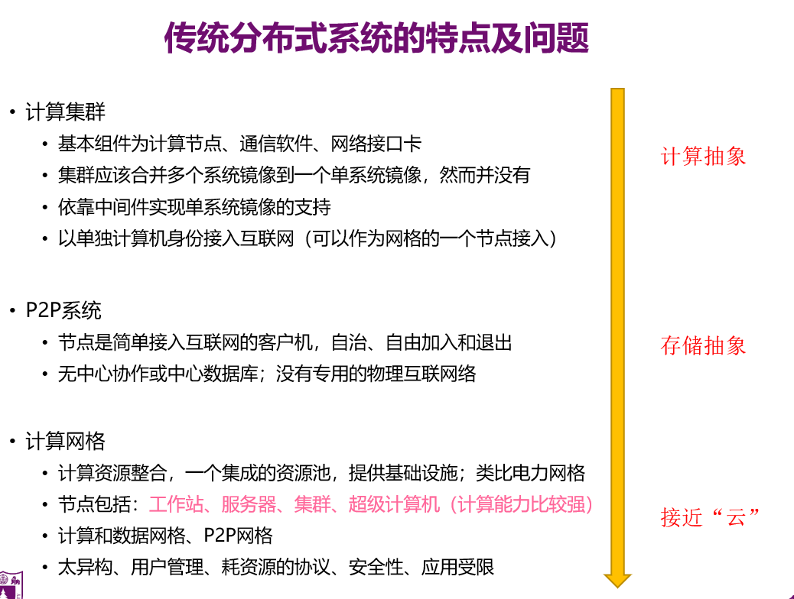

# 一、概述

## 1.概念

**什么是云计算？**

**为什么需要云计算？**

大数据时代的要求

从企业的角度，云计算解决了IT资源的动态需求和最终成本问题，使得IT部门可以专注于服务的提供和业务运营

降低中小企业的成本

**商业方面**

**1前期基础设施投资几乎为零**。

**2即时灵活**。

**3缩短产品上线时间**。

还因为云计算提供下列的服务

**1.自动化**

**2.开发周期有效**

**3.** **灾难恢复和业务连续性**

按需提供           计算、存储（分布式）、网络三种资源

分布式计算、虚拟化技术是实现云平台的核心

。安全：容灾备份、快照

。效率：一系列调度算法来实现

。云计算和其他计算方式相比的优点？**经济性、廉价**

1地价、电价

2计算设备、存储设备：因为利用率的提升，再很多用户间平摊、降低成本

3规模增大，单位的资源需要的人力降低

## 2.从计算机发展的过程中来看，云计算发展的状况

机械计算机->第一台电子计算机按尼亚克->图灵机

。设计计算机时主要考虑的：

1自动化（解决脑力劳动）

2易用性（机械的方式->电来驱动）

3高效（效率很高，能够足够快地解决问题）

。集中式计算（单个物理系统之内）、并行式计算（还是在同一物理系统之内，不过能同时解决多个用户的问题）

。

计算集群

p2p集群

网格计算 用现有设备联合起来解决更加复杂的问题	里面的设备可能时异构的

将分布的异构设备虚拟化成一台可用设备对外服务（抽象），是一个聚合的过程

而：云计算 为了按需使用专门构建的计算机集群	强调设备的同构性，让我们易于管理

单台设备虚拟化成多台设备

（hadoop的master节点主要要满足高可用、高性能）

（谷歌首先使用云计算技术）

发展趋势：互联网云化

**部署模型、服务模型**

**哪几种服务模型 	必考！**    云计算的服务模型及简介

部署模型：公有云、私有云、混合云

## 3.基本实现方式

对外服务

管理中间件  openstack云操作系统

虚拟化技术

底层物理资源池（云数据中心一章 ppt）

**机遇与挑战**

问题：安全性（用户远离物理机，涉及到资源隔离的问题；自然灾害）、法律问题

# 二、虚拟化

什么是虚拟化？聚合与切分（单台物理设备->多台虚拟设备）

云计算里	数据中心虚拟化的对象有哪些？x3

1服务器虚拟化

从服务器角度看虚拟化的级别：

2存储虚拟化：3种

3网络虚拟化：核心层、接入层、虚拟机本身的虚拟化	与openstack的网络节点关联，网络节点怎么实现	                          3网络 这3个虚拟化，openstack中每个计算节点上始终怎么实现虚拟化的

（还有桌面级虚拟化）

# 三、openstack  Iaas？.......

openstack的理念？

openstack和云计算之间的关系？

openstack是来管理云环境的，为普通用户提供使用接口，为管理员提供管理计算设备、存储设备、网络设备的接口

**但是只负责控制层面**，具体的执行层面是通过整合不同的组件实现的（即openstack的概念模型，哪些组件，组件之间的交互关系）

组件：(有张图，**概念模型**)

网络、存储（块存储、对象存储）nova newtrun？

认证、数据库、基础的消息队列 

仪表盘、监控 质量服务

**逻辑模型**：计算 存储 网络

**物理模型**：这些节点怎么通过互联网、内部网络（计算网络、存储网络、管理网络）管理

之所以出现对象存储，是为了克服块存储与文件存储的缺点，发扬他俩各自的优点。

**简单地说，块存储读写块，不利于共享，文件存储读写慢，利于共享。**

**为什么对象存储兼具块存储与文件存储的好处，还要使用块存储或文件存储呢？**

1、有一类应用是需要存储直接裸盘映射的，例如数据库。因为数据库需要存储裸盘映射给自己后，再根据自己的数据库文件系统来对裸盘进行格式化，所以是不能够采用其他已经被格式化为某种文件系统的存储的。数据库更适合使用块存储。

2、对象存储的成本比普通的文件存储高，需要购买专门的对象存储软件以及大容量硬盘

OpenStack 是一个分布式系统，由若干不同功能的节点（Node）组成：

1. 控制节点（Controller Node） 管理 OpenStack，其上运行的服务有 Keystone、Glance、Horizon 、telemetry以及 Nova管理组件和api等。 控制节点也运行支持 OpenStack 的基础架构服务，例如 SQL 数据库（通常是 MySQL）、消息队列（主要是RabbitMQ）和网络时间服务 NTP。     

2. 网络节点（Network Node） 其上运行的服务为 Neutron。 为 OpenStack 提供 L2 和 L3 网络。 包括虚拟机网络、DHCP、路由、NAT 、**虚拟网络vlan的实现**、vpn等。     

3. 存储节点（Storage Node） 可以提供块存储（Cinder）或对象存储（Swift）服务。     

4. 计算节点（Compute Node） 其上运行 Hypervisor（默认使用 KVM）。计算节点运行nova-compute服务，负责启动和终止虚拟机，通过消息总线监听虚拟机相关请求；Hypervisor是计算节点的核心，又称VMM。

   Openstack中虚拟机管理程序 能够支持各种VMM以及Docker 

   （同时运行 Neutron 服务的 agent，为虚拟机提供网络支持。 ）++

控制器节点、计算节点、存储节点、网络节点（只要知道功能和名称）

openstack是什么？一张图-黑板

# 四、数据中心

怎么设计云数据中心  空调、散热、变压器...设备安全、物理环境安全++

云数据中心哪些特点？1高设备利用率、**2绿色节能**、3高可用、4自动管理

为了实现绿色节能，云数据中心可以有哪些设计

为什么要绿色节能？要与云结合

哪几个角度实现绿色节能？配电、空调、集装箱、调度算法（宏观->微观，如微观cpu）、清洁能源

网络的哪些方面体现了云计算服务中心的不同之处

有哪些层次的网络？树、改进树、递归层次网络、sdn

给定一个网络结构，最多能容纳多少主机？

# 五、hadoop

。

**窄依赖是指父RDD的每个分区只被子RDD的一个分区所使用，子RDD分区通常对应常数个父RDD分区(O(1)，与数据规模无关)**

**相应的，宽依赖是指父RDD的每个分区都可能被多个子RDD分区所使用，子RDD分区通常对应所有的父RDD分区(O(n)，与数据规模有关)**

用paas：按照规定的方式实现自己的程序

spark和hadoop的关系：

spark对hadoop里mapReduce的扩充

spark对hadoop在哪些方面做了改进？对mapReduce的算子进行了扩充（除了map、reduce还有其他操作）

hadoop的yarn（集群计算资源的管理系统），spark可以运行在yarn之上

**请你对比hadoop和spark**

**重点：**

1.云计算的服务模型、部署模型

2.openstack和云计算的关系？openstack是什么？云计算是什么？（我们为什么要云计算）

3.openstack的概念模型、逻辑模型、物理模型

4.虚拟化和云计算的关系？虚拟化是什么？

5.为什么要绿色节能？绿色节能哪些方面？

6.云计算和云平台的特征，计算特性

7.网络：各种树的计算题

8.虚拟化的层次、对象、类型

