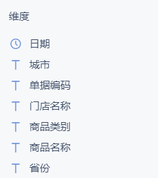
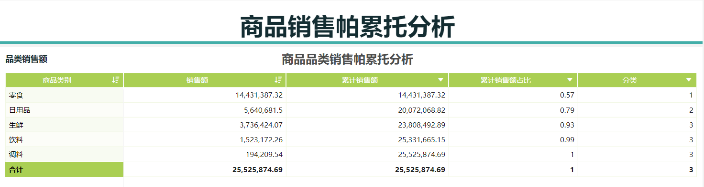
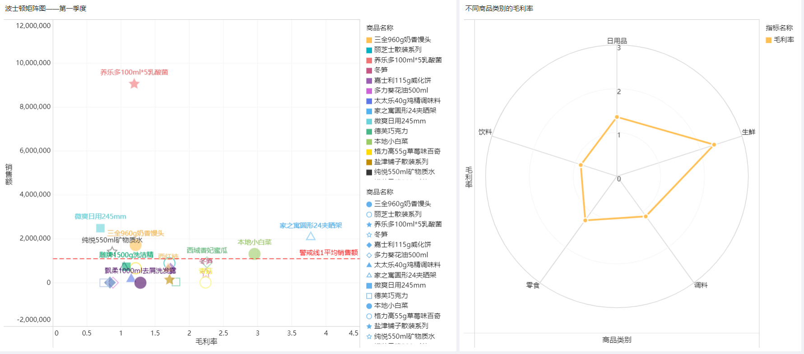
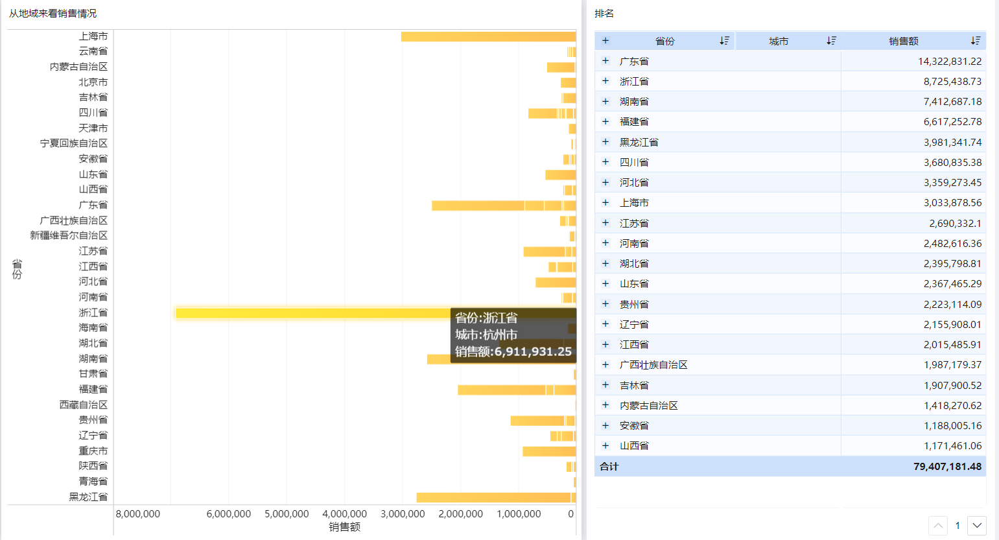
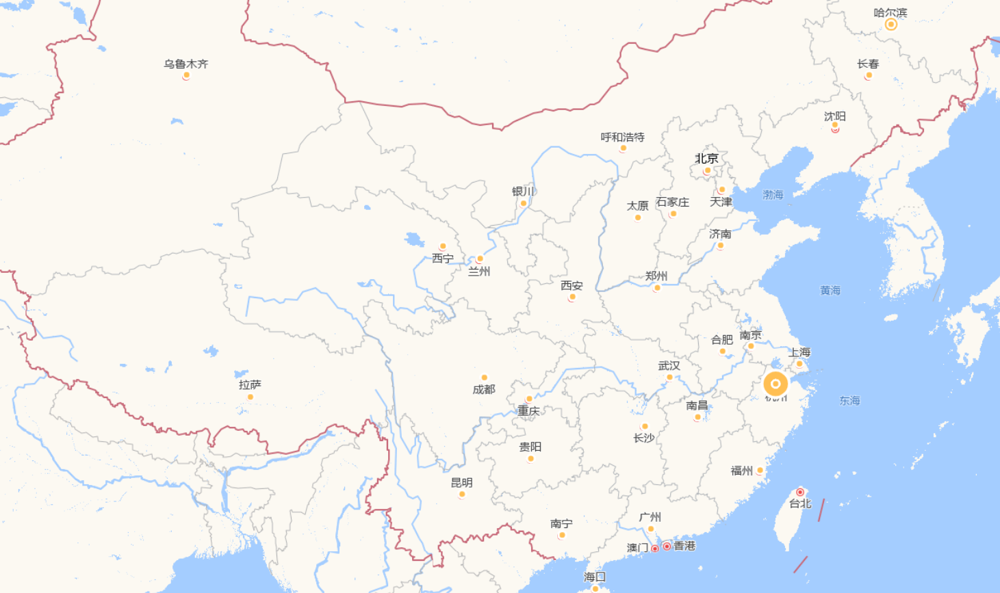
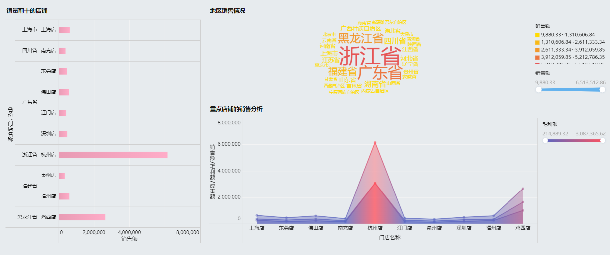

# Olap分析

# 191850189 王涛

**本次作业目的在于了解olap分析工具、olap分析过程，需要熟悉的操作包括切片、旋转、下钻、上卷**

## 一、OLAP分析工具与数据源

使用“Finebi”分析工具进行分析

Finebi商业智能软件内置了大量的图表以及分析模型，通过简单的拖动就可以为图表不同的坐标添加维度或指标，使用方便，且形成的可视化结果清晰美观，能够在较短的时间内制作出决策人员希望得到的多维度报表。

说明：在Finebi中，课上所讲的“度量”是用“指标”来表示的。

## 二、数据集合说明

数据源：由于初步学习olap操作，没有选择复杂庞大的数据源，而选取Finebi自带的“集团商品销售总表”进行olap分析，从销售这个生活中接触相对较多的方面入手。

该数据集合包含某全国连锁超市2020年1-4月(4月的数据不全)的销售记录，超市售卖的商品共5大类，分别为生鲜、饮料、调料、零食、日用品，表中共40514条数据。

原始数据共七个维度，五个指标，如图所示：

## 三、分析过程及结论

我们希望通过对销售表进行olap分析，综合时间周期、产品类别、地理分布、客户群类等多种因素来考量，得出有助于决策的数据。

### 1.对商品品类进行帕累托分析，从消费者购买意愿看商品经营的侧重点

帕累托分析即“二八定律”，在任何一组东西中，最重要的只占其中一小部分，其余尽管是多数，却是次要的。根据事物的主要特征，进行分类排队，把被分析的对象按照占比分成 1、2、3三类，从而分清重点和一般，有区别地确定管理方式。

**分析思路：**不考虑时间维度，因为总的来说，该超市销售的5类商品并不是某个季节或者时期才特别需要的，这里选取总销售额和商品类别两个维度分析数据；计算不同品类商品累计销售额及其占比，将品类按照累计销售额占比分三类

0-70% 1类、70%-90% 2类、90%-100% 3类

分析结果显示，超市的零食销售最为重要，需要重点管理；其次是日用品；最后是生鲜、饮料和调料。这样的结果也有助于帮助商家进行库存囤积方面的决策。

如果有2019年的相关数据，则可以计算销售量的同比，分析公司发展的情况；若销量下降，则可以从销售单价、生产成本、毛利率方面计算同比，分析销量下降的原因所在。

如果有其他店铺的销售信息，则可以通过对比，分析3类产品是本身需求确实相对较少还是超市在这方面没有经营管理好导致的销量不佳。由于生活中调料等用品确实需求相对较少，年轻人地零食消费确实很高，这里简单地认为超市在各方面产品经营都尚可地情况下，零食类产品受到了大众的喜爱。

### 2.对所有商品进行波士顿矩阵图分析，从总销量、毛利率方面看利润增长点

切片，选取2020年第一季度的销售记录进行分析以协助制定下一季度的销售计划；并制作不同商品类的毛利率情况表，将两张表格并列对比，既可以看到单个产品的销售情况，也可以更宏观地看到某个商品类的销售情况。

如图所示，通过计算各个商品的总销售额和毛利率进行分析，并设置警戒线，警戒线标识商品的平均销售额；在右图中，距离中心点越远则毛利率越高。

可以看到，所有销售产品中，养乐多100ml*5乳酸菌的销售量最高，其他产品的销售量相对集中。

从毛利率方面看，养乐多乳酸菌的毛利率与大部分商品的毛利率在同一水准，落入0.7-1.5的范围之内，毛利率不错的情况下，高销量可以在这一商品上带来可观的利润；密瓜、冬笋、香菇、本地小白菜的毛利率相对较高，很容易观察到这几个商品都属于蔬菜生鲜的商品范畴，所以在这个维度观察之余，整理出不同类别商品的毛利率对比图（右图）辅助分析可以更好地帮助决策；家之寓圆形24夹晒架的毛利率最高，而且在除却养乐多乳酸菌的商品中，销售量也处于前列位置，从利润地角度出发，这种毛利率与销量都很高的商品可以为商家带来更高的利润率。

结合右图，整体来看，的确生鲜类地商品毛利率较高。由于Finebi中缺少对当前数据集更为详尽的解释，无法得知在生鲜类商品中，成本是否已经覆盖了生鲜的保鲜费用（别的商品是没有这方面的成本需求的，所以要特别考虑）。如果成本额已经覆盖了此类成本，那么丰富生鲜类商品的种类将是一个不错的选择。

### 3.从地域看销售情况，从省份和城市两个维度来看销售额

图1：

如图1所示，浙江省的销售额最高，黑龙江省的销量其次；鼠标移动到对比柱状图的相应位置就会显示出相应城市的名称，在浙江省，绝大部分的销售额都是来自于杭州市，该超市在杭州市非常受欢迎。

图2（部分未开设门店地区没有截入）：

图2更加直观地展示了门店在全国地分布情况以及各大门店的总体销售情况，大部分门店开设在东部地区，中部和西部地区的门店较少，结合图1可知，东部和东南沿海城市的销售情况较好，中西部只有四川省的销售占比较高。

### 4.从门店方面看

浙江省杭州店销量一枝独秀，远超其他店铺，广东省的店铺销量分布比较均匀，，上海、四川、福建、黑龙江的店铺销量不错。在毛利额上，销量前十的店铺表现都不错。可以观察到的是，连锁超市在经济大省江苏的占有并不高，店铺的销量没有一家进入前十，北京也没有店铺进入前十，如果需要提高市场占有率或知名度，该超市可以着重关注一这两个地域。

### 5.从时间上来看，计算销售环比，看超市短期发展状况

数据量较少，只能计算两个环比值（4月数据不全，计算的环比没有参考价值故不计算），从这两个数据来看，超市的总体销售情况是稳中向好的。

### 四、决策说明

从商品的类别看，零食类非常重要，需要专门安排相关人员做好零食类商品的选品与销售，零食库存持有量必须保持充足，日用品的库存也要有较高的保有量，其他的商品类别库存可相对较少；

在零食类商品中，养乐多乳酸菌的销量非常好，超市要关注此类饮品，尝试引入更多类似的产品，同时注意库存变化，可以适当囤积库存；为了提高超市的利润率，要在生鲜类产品上发力，因为生鲜类产品的毛利率最高且销量不错，可以通过丰富生鲜的种类、保证生鲜的新鲜度来吸引更多的用户到超市来购买生鲜类产品；

目前超市在杭州的店铺经营得最好，浙江除杭州外的地区销售额并不突出，上海、广东、黑龙江的经营总体不错，可以尝试将杭州店的成功运营方式用到大环境类似的店铺上以提升销量，尤其可以尝试在北京、江苏的南京这样的城市应用成功的案例，通过在大城市扎根提升知名度与影响力。同时可以尝试在较小的城市运用和大城市有差别的运营方式，以提升小城市的营业额，下沉时常、获得更多的用户基础。

整体上来看，连锁超市目前的总体发展情况不错，改善经营方式时，可以在一些店铺开展试点，运营成功后再推广，以降低运营不佳的损失，连锁超市目前应该力争稳中求进。

​                                         