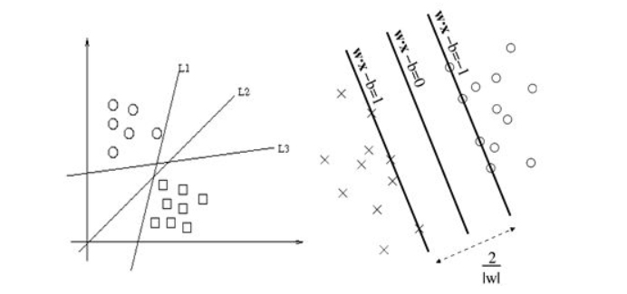
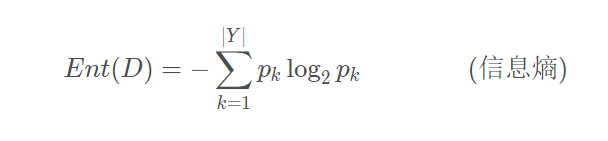
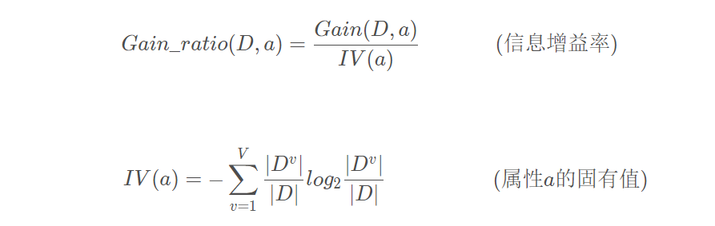
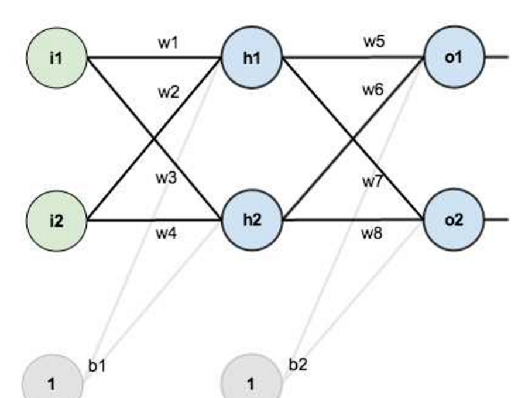
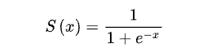
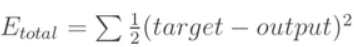

# 大数据第三次作业

# 191850189 王涛

## 内容：用SVM、决策树、BPNN三种算法对Iris鸢尾花数据集进行分类任务

## 1.准备——数据获取与数据集划分

导入鸢尾花数据集并使用train_test_split()函数按照6：4的比例划分训练集和测试集

```
from sklearn.datasets import load_iris #导入鸢尾花数据集
from sklearn.model_selection import train_test_split

# 加载iris数据集
def load_data():
    iris = load_iris()
    X_train,X_test,Y_train,Y_test = train_test_split(iris.data,iris.target,test_size=0.4) #从数据集中随机划分训练集和测试集，这里按照训练集：测试集=6：4进行划分
    return X_train, X_test, Y_train, Y_test
```

## 2.实现

### 1.SVM算法

#### svm概览：

svm即支持向量机（support vector machines, SVM），是一种监督式学习的方法，是一种二分类模型，可广泛地应用于统计分类以及回归分析。它将向量映射到一个更高维的空间里，在这个空间里建立一个最大间隔超平面。在分隔超平面的两边建有两个互相平行的超平面，分隔超平面使两个平行超平面的距离最大化。假定平行超平面间的距离或差距越大，分类器的总误差越小。

以二维空间举例：如下图所示，平面上有两类不同的数据，分别用圆圈和方块表示，可以很简单地找到一条直线使得两类数据正好能够完全分开。svm分类方法中希望找到一条直线，使得点到直线的最小距离最大化。在数据样本随机出现的情况下，这样的一条直线形成的分割能让后续预测的准确率尽可能高，在高维空间中这样的直线称之为超平面，因为维数大于三的时候我们已经无法想象出这个平面的具体样子，距离超平面最近的点称为支持向量。



#### 关于最大分离器Maximum Margin Classifier的定义：

1. 
   $$
   最大间隔分类器的目标函数为：\max\hat{\gamma}
   $$
   
2. 
   $$
   其他满足条件:y_i(w^Tx_i + b) = \hat{\gamma_i}\geq\hat{\gamma}, i = 1,...,n
   $$
   
3. 
   $$
   如果函数间隔\hat{\gamma}为1，上述目标函数在转化为\max\frac{1}{||w||}, s.t.\ y_i(w^Tx_i + b) \geq 1, i = 1, ..., n
   $$


#### 关于核函数：

一些数据在低维平面线性不可分，对于这些数据，可以通过构建映射函数将它们放在一个高维空间中去处理，构建高维线性可分模型，核函数就是为了解决这样的问题。

**过程：**

#### a.构建模型、训练模型与准确度评估：


```
from sklearn import svm

def test_SVC(X_train,X_test,Y_train,Y_test):
    svm_classifier = svm.SVC(C=1.0, kernel='rbf', decision_function_shape='ovr', gamma=0.01) #构建
    svm_classifier.fit(X_train, Y_train) #训练
    # 评估
    print("训练集准确率:", svm_classifier.score(X_train, Y_train))
    print("测试集准确率:", svm_classifier.score(X_test, Y_test))
```

svm.SVC()参数解析：

- `C`:`C-SVC`的惩罚参数，默认值为1.0，C相当于惩罚松弛变量
  - C值大，即对误分类的惩罚增大，趋向于对训练集圈粉对的情况，这样对训练集的测试准确率更高，但泛化能力弱。
  - C值小，对误分类的惩罚减小，允许出错化将他们作为噪声点，泛化能力较强。
- `decision_function_shape`：决策函数形状
  - None
  - `ovo`:one versus one, 一对一 的分类器，这时对于K个类别需要构建 $\frac{k * (k - 1)}{2}$个分类器
  - `ovr`:one versus rest, 一对其他 的分类器，这时对K个类别只需要构建K个分类器
- `kernel`:核函数，默认为rbf
  - `rbf`:高斯核函数
  - `poly`:多项式核函数
  - `linear`:线性核函数
  - `sigmoid`:sigmoid函数
- `degree`:如果选择多项式核函数poly，默认是3，选择其他核函数时会被忽略。
- `gamma`:高斯核函数、多项式核函数和sigmoid核函数的参数，默认是`auto`
- `coef0`:核函数的常数项，对于多项式核函数和sigmoid有效
- `probability`:是否采用概率估计，默认为False
- `shrinking`:是否使用shrinking heuristic(启发式收缩)，默认为`True`
- `tol`:停止训练的误差大小，默认为1e-3
- `cache_size`:核函数cache缓存大小，默认为200
- `class_weight`:类别的权重，字段形式传递，设置第几类的参数C为weight * C
- `verbose`:是否允许冗余输出
- `max_iter`:最大迭代次数，-1为无限制
- `random_state`:数据洗牌时的种子值，int

#### b.执行及结果：

```
if __name__=="__main__":
    X_train,X_test,Y_train,Y_test=load_data()     
    test_SVC(X_train,X_test,Y_train,Y_test)
```


当然结果每一次运行可能是不一样的，因为训练集与测试集是随机划分的

### 2.决策树算法

#### 决策树概览：

决策树算法构造决策树来发现数据中蕴涵的分类规则，如何构造精度高、规模小的决策树是决策树算法的核心内容。

决策树构造可以分两步进行。第一步，决策树的生成：由训练样本集生成决策树。第二步，决策树的剪枝：决策树的剪枝是对上一阶段生成的决策树进行检验、校正的过程，主要是用测试数据集中的数据校验第一步中生成的决策树。由于第一步中不停地对结点进行划分，整棵树的分支可能过多，造成决策树很庞大。决策树过于庞大，有可能出现过拟合的情况，决策树越复杂，过拟合的程度会越高，这对于后续数据的预测是很不利的，剪纸可以用于解决这样的过度拟合情况。除了这样的后剪枝（全部构造完成再剪枝），还有预剪枝和边构造边剪枝。

#### 构建决策树有多种算法，包括ID3、C4.5、CART等

##### 1.ID3：

ID3算法核心是根据 “最大信息熵增益” 原则选择划分当前数据集的最好特征。



建立决策树的过程中，根据特征属性划分数据，使得原本 “混乱” 数据的熵(混乱度)减少，按照不同特征划分数据熵减少的程度会不一样。 ID3算法中选择熵减少程度最大的特征来划分数据，也就是“最大信息熵增益”原则。


##### 2.C4.5

C4.5算法流程与ID3相类似，但是将信息增益改为信息增益比，以解决偏向取值较多的属性的问题，相比ID3，它可以处理连续型属性。



属性 a 的取值数目越多( V 越大)，则 IV(a) 的值通常越大。

##### 3.CART

CART(Classification And Regression Tree，分类回归树算法)，是一种二分递归分割技术，把当前样本划分为两个子样本，使得生成的每个非叶子结点都有两个分支，因此CART算法生成的决策树是结构简洁的二叉树。由于CART算法构成的是一个二叉树，它在每一步的决策时只是“是”或者“否”，即使一个feature有多个取值，也是把数据分为两部分。

无论是ID3还是C4.5，都基于信息论的熵模型，这里面会涉及大量的对数运算。CART分类树算法使用基尼系数来代替信息增益比，基尼系数代表了模型的不纯度，基尼系数越小，则不纯度越低，特征越好。相比基于信息论的熵模型的算法，CART决策树形成过程中可以减少大量的对数运算。

**过程：**

#### a.分割数据集后，设置决策树分类器

```
x_train, x_test, y_train, y_test = load_data() # 调用数据加载与分割函数
clf = tree.DecisionTreeClassifier(criterion="entropy") # 设置决策树分类器，也可以选择gini
```

#### b.训练模型

```
clf.fit(x_train, y_train) # 训练模型
```

#### c.模型评估

```
score = clf.score(x_test, y_test) # 模型评估
```

#### d.使用graphviz进行模型图像绘制

```
import graphviz
iris = load_iris()
feature_names = iris.feature_names
target_names = iris.target_names
clf_dot = tree.export_graphviz(clf,
out_file= None,
feature_names= feature_names,
class_names= target_names,
filled= True,
rounded= True) # 绘制决策树模型

graph = graphviz.Source(clf_dot, 
filename= "iris_decisionTree.gv", 
format= "png")
graph.view()

```

### 3.BPNN神经网路算法

#### BPNN概览：

BPNN是模仿人类的神经元激活、传递过程形成的算法。以三层神经网络为例，BP神经网络含输入层、隐含层、输出层三层结构。输入层接收数据，输出层输出数据，前一层神经元连接到下一层神经元，收集上一层神经元传递来的信息，经过“激活”把值传递给下一层。



前向传递：
w是连接前后两层神经元的权重，例如h1的输入就是前一层神经元输出的加权之和（再加上偏置），即i1*w1+i2*w2+b1*1。h1的输出是对这个输入的“激活”。模型里激活是以激活函数的形式体现的，比如常用的激活函数是Sigmoid函数：



该函数模仿神经元之间的传递，将范围很大的数限定到0到1之间，作为信号往后传递，每层神经元接收上一层神经元的信号，在自己这里激活，传到下一层神经元。

反向误差传播：

一般我们会随机初始化权重和偏置，这种参数设定十分随意，不可能第一次就能把这个模型确定，必须有一个“学习机制”，让模型的参数不断优化以达到最佳状态，BPNN是按照误差逆向传播算法训练的多层前馈神经网络，通过反向误差传播完善模型。反向传播使用了梯度下降的方法来对参数进行修正，以提高拟合效果。具体地，反向传播是为了使得Etotal达到最小

总误差Etotal：



**过程：**

1. #### 初始化参数

   ```
   def initialize_parameters(n_x, n_h, n_y):
       np.random.seed(2)
   
       # 权重和偏置矩阵
       w1 = np.random.randn(n_h, n_x) * 0.01
       b1 = np.zeros(shape=(n_h, 1))
       w2 = np.random.randn(n_y, n_h) * 0.01
       b2 = np.zeros(shape=(n_y, 1))
   
       # 用字典存储参数
       parameters = {'w1': w1, 'b1': b1, 'w2': w2, 'b2': b2}
   
       return parameters
   ```

   

2. #### 前向传播

   ```
   def forward_propagation(X, parameters):
       w1 = parameters['w1']
       b1 = parameters['b1']
       w2 = parameters['w2']
       b2 = parameters['b2']
   
       # 通过前向传播来计算a2
       z1 = np.dot(w1, X) + b1
       a1 = np.tanh(z1)            # tanh————第一层的激活函数
       z2 = np.dot(w2, a1) + b2
       a2 = 1 / (1 + np.exp(-z2))  # sigmoid————第二层的激活函数
   
       # 通过字典存储参数
       cache = {'z1': z1, 'a1': a1, 'z2': z2, 'a2': a2}
   
       return a2, cache
   
   ```

   

3. #### 计算代价函数

   ```
   def compute_cost(a2, Y, parameters):
       m = Y.shape[1]      # 训练样本总数
   
       # 代价函数选择交叉熵（cross-entropy）
       logprobs = np.multiply(np.log(a2), Y) + np.multiply((1 - Y), np.log(1 - a2))
       cost = - np.sum(logprobs) / m
   
       return cost
   ```

   

4. #### 反向传播

   ```
   def backward_propagation(parameters, cache, X, Y):
       m = Y.shape[1]
       w2 = parameters['w2']
   
       a1 = cache['a1']
       a2 = cache['a2']
   
       # 计算dw1、db1、dw2、db2
       dz2 = a2 - Y
       dw2 = (1 / m) * np.dot(dz2, a1.T)
       db2 = (1 / m) * np.sum(dz2, axis=1, keepdims=True)
       dz1 = np.multiply(np.dot(w2.T, dz2), 1 - np.power(a1, 2))
       dw1 = (1 / m) * np.dot(dz1, X.T)
       db1 = (1 / m) * np.sum(dz1, axis=1, keepdims=True)
   
       grads = {'dw1': dw1, 'db1': db1, 'dw2': dw2, 'db2': db2}
   
       return grads
   ```

   

5. #### 更新参数

   ```
   def update_parameters(parameters, grads, learning_rate=0.4):
   	# 从字典里拿参数
       w1 = parameters['w1']
       b1 = parameters['b1']
       w2 = parameters['w2']
       b2 = parameters['b2']
   
       dw1 = grads['dw1']
       db1 = grads['db1']
       dw2 = grads['dw2']
       db2 = grads['db2']
   
       # 参数更新计算
       w1 = w1 - dw1 * learning_rate
       b1 = b1 - db1 * learning_rate
       w2 = w2 - dw2 * learning_rate
       b2 = b2 - db2 * learning_rate
   
       parameters = {'w1': w1, 'b1': b1, 'w2': w2, 'b2': b2}
   
       return parameters
   ```

   

6. #### 模型评估

   ```
   def predict(parameters, x_test, y_test):
       w1 = parameters['w1']
       b1 = parameters['b1']
       w2 = parameters['w2']
       b2 = parameters['b2']
       z1 = np.dot(w1, x_test) + b1
       a1 = np.tanh(z1)
       z2 = np.dot(w2, a1) + b2
       a2 = 1 / (1 + np.exp(-z2))
   
       # 结果的维度
       n_rows = y_test.shape[0]
       n_cols = y_test.shape[1]
       # 预测值结果存储
       output = np.empty(shape=(n_rows, n_cols), dtype=int)
   
       for i in range(n_rows):
           for j in range(n_cols):
               if a2[i][j] > 0.5:
                   output[i][j] = 1
               else:
                   output[i][j] = 0
   
       print('预测结果：')
       print(output)
       print('真实结果：')
       print(y_test)
   
       count = 0
       for k in range(0, n_cols):
           if output[0][k] == y_test[0][k] and output[1][k] == y_test[1][k] and output[2][k] == y_test[2][k]:
               count = count + 1
           else:
               print(k)
               
       acc = count / int(y_test.shape[1]) * 100
       print('准确率：%.2f%%' % acc)
       
       return output
   
   ```

7. 建立神经网络、运行与评估

```
def nn_model(X, Y, n_h, n_input, n_output, num_iterations=10000, print_cost=False):
    np.random.seed(3)

    n_x = n_input           # 输入层节点数
    n_y = n_output          # 输出层节点数

    # 1.初始化
    parameters = initialize_parameters(n_x, n_h, n_y)

    # 梯度下降
    for i in range(0, num_iterations):
        # 2.前向传播
        a2, cache = forward_propagation(X, parameters)
        # 3.计算代价函数
        cost = compute_cost(a2, Y, parameters)
        # 4.反向传播
        grads = backward_propagation(parameters, cache, X, Y)
        # 5.更新参数
        parameters = update_parameters(parameters, grads)

        # 每1000次迭代，输出一次代价函数
        if print_cost and i % 1000 == 0:
            print('迭代第%i次，代价函数为：%f' % (i, cost))

    return parameters
    

if __name__ == "__main__":
    # 读取数据
    data_set = pd.read_csv('iris_training.csv', header=None)

    X = data_set.iloc[:, 0:4].values.T          
    Y = data_set.iloc[:, 4:].values.T           
    Y = Y.astype('uint8')

    # 训练
    start_time = datetime.datetime.now()
    parameters = nn_model(X, Y, n_h=10, n_input=4, n_output=3, num_iterations=10000, print_cost=True)
    end_time = datetime.datetime.now()
    print("用时：" + str((end_time - start_time).seconds) + 's' + str(round((end_time - start_time).microseconds / 1000)) + 'ms')

    # 模型评估
    data_test = pd.read_csv('iris_test.csv', header=None)
    x_test = data_test.iloc[:, 0:4].values.T
    y_test = data_test.iloc[:, 4:].values.T
    y_test = y_test.astype('uint8')
    result = predict(parameters, x_test, y_test)
```

