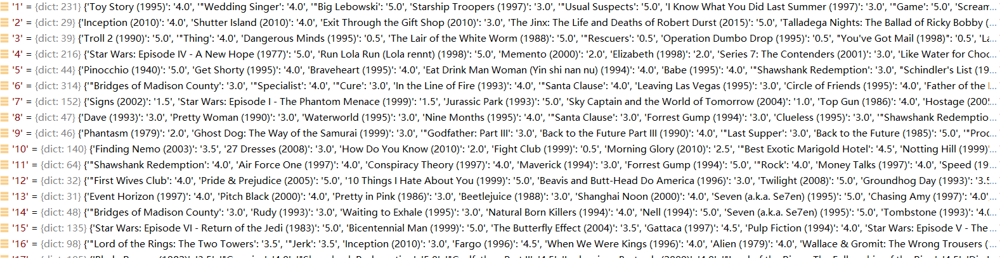
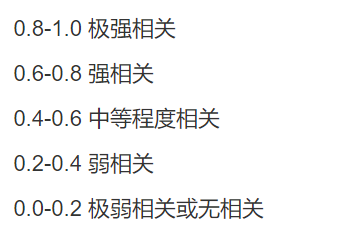

# 大数据第四次作业——基于movielens数据集的推荐系统

# 191850189 王涛


## 1.推荐算法——基于用户的协同过滤算法（user-based CF）

这里选择使用协同过滤算法（基于用户）进行推荐，该算法给用户推荐兴趣相似的其他用户喜欢看的电影。

具体实现步骤为（以向用户A推荐电影为例）：

1.计算用户A与其他用户之间的相似度，如果某个用户与用户A没有对同一部电影评分，则认为他们两者之间的相似度为0，否则选择一种度量相似度的计算方法，如欧氏距离、皮尔逊相关系数等，根据用户A与其他用户对相同电影的评分来计算用户A与其他用户之间的相似度。计算完成后，选择相似度较高的n位用户。

2.将选择出的与用户A相相似度较高的n位用户称为用户A的类似群体，找到他们喜欢看的电影，从中去除用户A已经观看过的电影，根据评分高低推荐剩余的电影。

**加权处理：**为了使得推荐更加可靠，没有直接使用类似群体中某位用户的电影评分，而是进行了加权处理：找n个相关度很高的人，剔除用户A观看过的电影后，对他们看过的其他电影的评分进行加权

例如用户m与用户A的相关度为0.9，用户n与用户A的相关度为0.8，用户m看过一部电影并打分4.5分，用户n看过同样的电影并打分5分。则我们预估用户A对该部电影的打分为：
$$
4.5*（0.9/（0.9+0.8））+5*（0.8/（0.9+0.8））=4.7
$$

## 2.代码实现

### 1.数据预处理，读取movies表、rating表，连接两表并去除不需要的列，将最终数据存入‘data.csv’

```
#数据初步处理
#相对路径存储
movies = pd.read_csv("..\ml-latest-small\movies.csv",encoding='unicode_escape')
ratings = pd.read_csv("..\ml-latest-small\\ratings.csv")
data = pd.merge(movies, ratings, on='movieId') # 连接两张表，在ratings表里增加电影名称信息
# 合并之后默认按照movieId升序排列
# 改成以用户Id升序排列,去除不需要的列
data=data[['userId','rating','movieId','title']].sort_values(by=['userId'])
#获取当前工作目录
os.getcwd()
data.to_csv('data.csv',index=False)
```

### 2.统计用户看过的电影，以及对电影的评分信息，存入字典，在此数据集中，电影名是唯一的，可以作为电影的唯一标识，为了推荐电影时较为方便地得到电影名，这里直接存储{电影名：评分}而没有选择使用电影的id

```
data0 = open("data.csv", 'r', encoding='UTF-8')
#字典存储
data = {}
#data:['userId','rating','movieId','title']
for line in data0.readlines()[1:]:
    line = line.strip().split(',')
    # 没有该用户，创建
    if not line[0] in data.keys():
        data[line[0]] = {line[3]: line[1]}
    # 否则添加该电影评分信息
    else:
        data[line[0]][line[3]] = line[1]
```

得到如下图所示的字典



### 3.选择皮尔逊相关系数度量相似度，构建Pearson相关系数计算函数

公式为：


（上下同时除以N可以简化计算）

```
def pearson(user1, user2):
    user1_data = data[user1]#user1_data里存放用户1评分过的电影，值是评分
    user2_data = data[user2]
    common = {}
    r = 0
    # 找共同电影
    for key in user1_data.keys():
        if key in user2_data.keys():
            common[key] = 1
    if len(common) == 0:
        return 0
    n = len(common)  # 共同电影数目

    #评分和
    sum1 = sum([float(user1_data[movie]) for movie in common])
    sum2 = sum([float(user2_data[movie]) for movie in common])

    #评分平方和
    sum1Sq = sum([pow(float(user1_data[movie]), 2) for movie in common])
    sum2Sq = sum([pow(float(user2_data[movie]), 2) for movie in common])

    #乘积和
    PSum = sum([float(user1_data[it]) * float(user2_data[it]) for it in common])

    #计算相关系数
    num = PSum - (sum1 * sum2 / n)
    den = sqrt((sum1Sq - pow(sum1, 2) / n) * (sum2Sq - pow(sum2, 2) / n))
    if den == 0:
        r=0
    else:
        r = num / den
    return r
```

### 4.找到与被推荐用户相似度较高的n个人

皮尔逊相关系数越大，相似度越高



```
#计算某个用户与其他用户的相似度，按照从高到低排序
#找到topN的相关的人，这里选择top5
def topN_similarUsers(userID):
    re = []
    for userid in data.keys():
        if not userid == userID:
            simliar = pearson(userID,userid)
            re.append((userid,simliar))
    re.sort(key=lambda val:val[1])
    #print(len(re))
    return re[:5]
```

### 5.构建推荐函数

#### 调用函数找出类似群体theSimilarUsers

```
theSimilarUsers=topN_similarUsers(userID)
```

#### 找出类似群体看过而被推荐用户没有看过的电影，根据类似群体对这些电影的评分进行加权，得到预估被推荐用户会对这些电影的评分

```
   #计算类似群体的相似度和，供加权时使用
   count=0
    pearsonSum=0
    while count<n:
        topSimUserID = theSimilarUsers[count][0]
        pearsonSum+=pearson(userID,topSimUserID)
        count+=1

#加权
    count = 0;
    while count<n:
        topSimUserID = theSimilarUsers[count][0]

        similarMovies = data[topSimUserID]
        for similarMovie in similarMovies.keys():
            if similarMovie not in data[userID].keys():
                if not similarMovie in recommendations.keys():
                    if pearsonSum!=0:
                        recommendations[similarMovie] = float(similarMovies[similarMovie]) * (pearson(userID, topSimUserID) / pearsonSum)
                    else:#最大相关的人相似度为0，置0，此时的推荐是模糊的
                        recommendations[similarMovie] = 0
                else:
                    if pearsonSum!=0:
                        recommendations[similarMovie] += float(similarMovies[similarMovie]) * (pearson(userID, topSimUserID) / pearsonSum)
                    else:
                        recommendations[similarMovie] += 0
        count+=1
```

#### 对电影评分由高到低排序

```
finalRec = sorted(recommendations.items(), key=lambda x: x[1], reverse=True)
```

注意：函数定义为

```
def recommend(userID,recNum):
```

recNum是希望给用户推荐的电影数量，在数据集较小而recNum较大时，可能找不到可以推荐的recNum部电影，所以要在函数末尾加上判断语句进行保护，防止程序因此崩溃

```
    if len(finalRec)>=recNum:
        return finalRec[:recNum]
    else:
        return finalRec
```

### 6.调用推荐函数，对每位用户给出推荐，将推荐结果存入'movie.csv'

```
finalLst=[]
for i in range(1,611):
    Recommendations = recommend(str(i),5)
    lst=[]
    lst.append(i)
    lstMovies=[]
    for j in range(5):
        lstMovies.append(Recommendations[j][0])
    lst.append(lstMovies)

    finalLst.append(lst)

df=pd.DataFrame(columns=['userId','movieId'],data=finalLst)
df = df.set_index('userId')
df.to_csv('movie.csv')
```

### 7.得到如图所示的'movie.csv'数据（由于电影名中有一些非中英文的字符，可能出现少数乱码）

**columns=['userId','movieId']**


