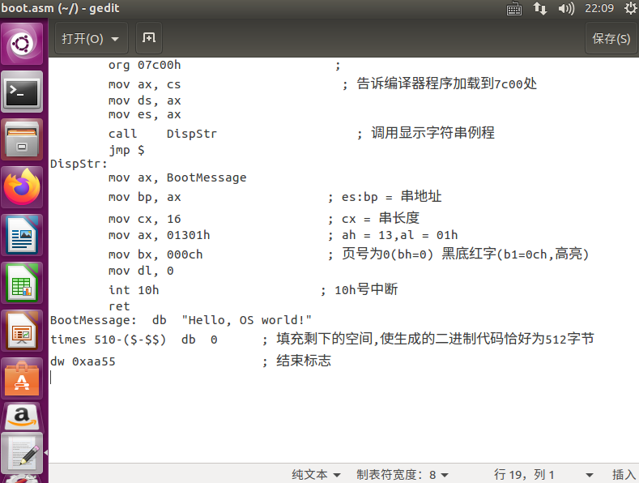
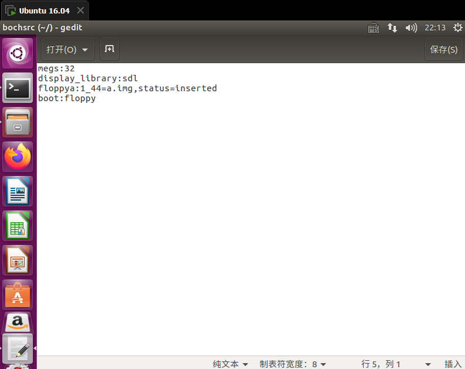
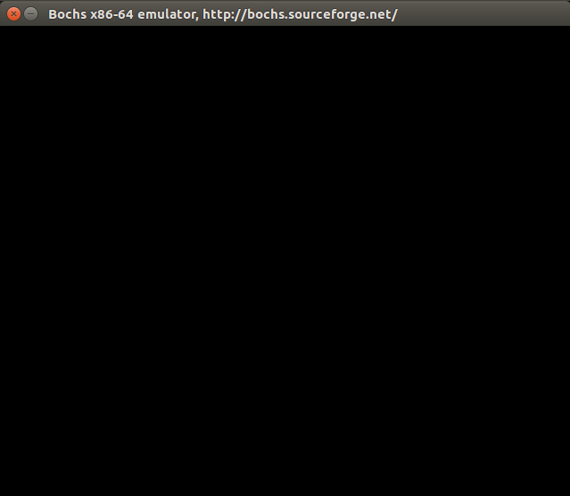
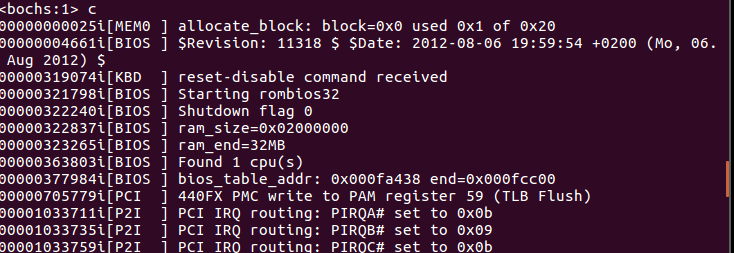
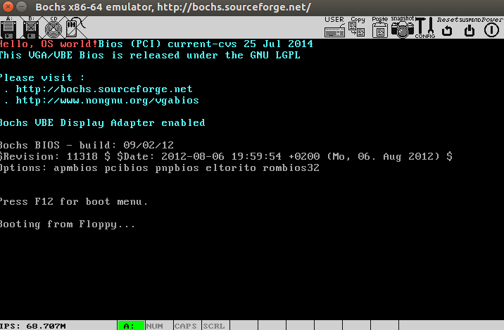

1.创建并编辑boot.asm



2.命令行依次输入下列指令

```
nasm boot.asm –o boot.bin
bximage  -> fd -> 1.44 -> a.img
dd if=boot.bin of=a.img bs=512 count=1 conv=notrunc
```

3.配置bochs



配置文件保存为bochsrc，和a.img以及boot.bin放在同一目录下

4.输入指令启动bochs

```
bochs –f bochsrc
```

跳出如下界面



输入c



成功



