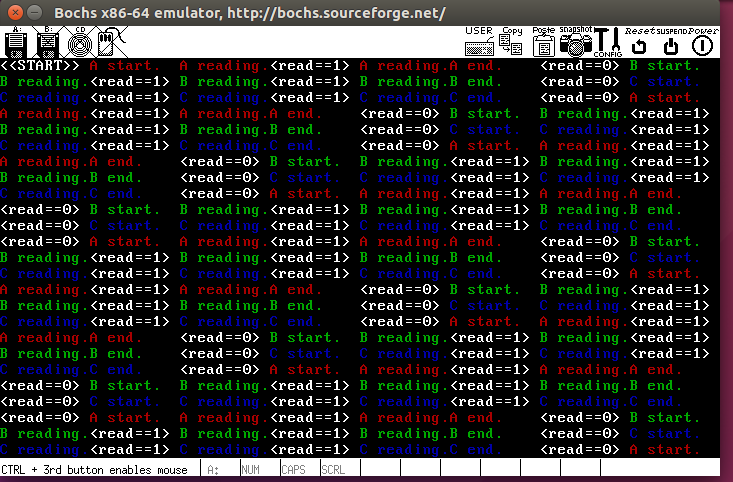
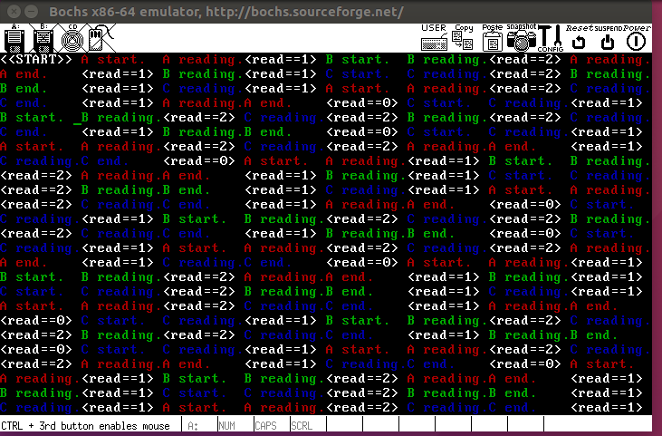
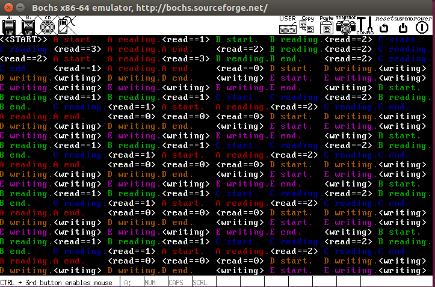
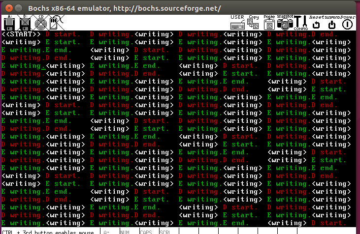
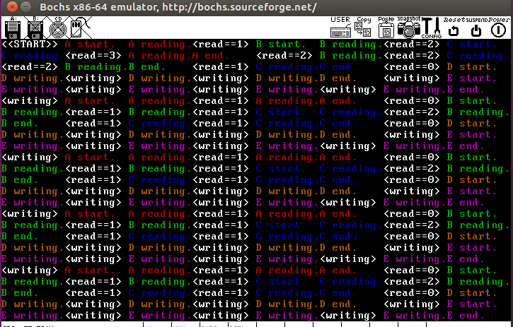
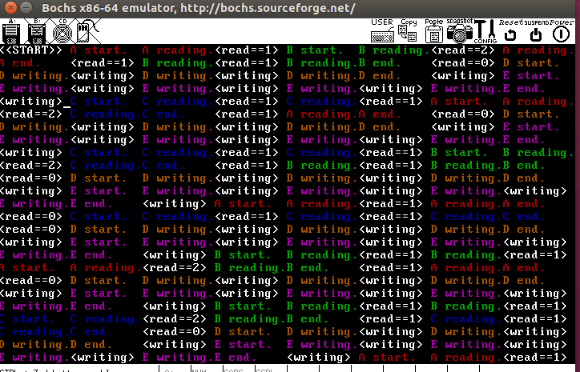
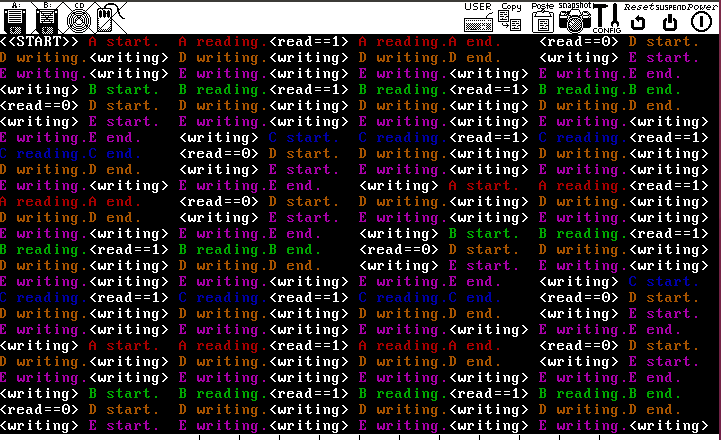

# 第四次实验说明文档

**本次实验共3个写者进程，2个读者进程**

orange‘s6r没有实现滚屏，最终结果不支持滚屏，屏幕满了之后会清空屏幕，否则显存会很快存满出错；为了展示方便，注释掉清屏代码，等到调度结果满一个屏幕之后ctrl+Z结束，观察结果（如果不断清屏会看不清，清屏的过程中终止可能得不到满屏的结果）。

## 说明：

### 1.封装系统调用参照orange's实现 

### 2.进程调度模块的主要思路：

1.

读者优先、写着优先和解决饿死问题的信号量使用是不一样的，分别为它们编写读写时的进程体

2.

维护一个ready队列，开始时，所有的进程都加入（F不加入），如果P操作没有获得资源则弹出，存入信号量队列；

在信号量队列中的进程被其它的V资源释放之后，回到ready队列等待调度

3.进程体内每打印一次delay 10ms（一个时钟中断的间隔时间），用这样的方法模拟一个时间片

## 一、读者优先

1.同时读的数量设为1，写者进程饿死

2.同时读的数量设为2>3个写者进程，写者进程饿死

3.同时读的数量设为3

此时写者进程有机会

## 二、写着优先

无论同时读的数量设为几，读者进程饿死

## 三、解决饿死问题

核心是一个FAIR_lock信号量

无论同时读的数量设为几所有的进程都有机会执行

同时读的数量设为3：

同时读的数量设为2：

同时读的数量设为1：

