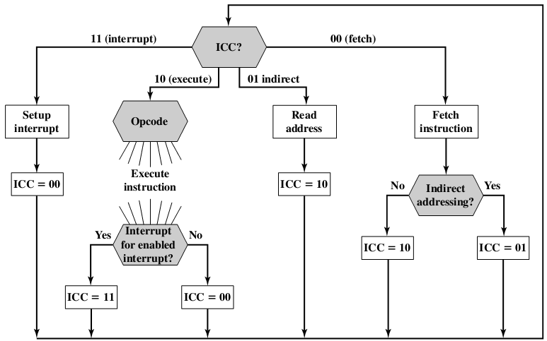

## 作业目标

实现指令控制状态机ICC

## 具体要求

上一次作业只要求能够解析和执行单条指令，本次作业要求能够执行一连串的指令

为此需要实现：
1. 实现 *opcode=0xf4 hlt* 指令
2. 在上一次作业的基础上实现ICC状态机，允许对代码进行重构

在CPU中，指令的执行流一般是由ICC进行控制，如图所示，其中不需要考虑ICC=0b11的中断分支：

## 补充说明

1. ICC状态机会不断重复获取、解析、执行指令，直到执行到hlt指令为止(实际上hlt是关机指令，为了避免实现复杂的中断(ICC=0b11)，本作业简单地将hlt指定为指令终止指令)
2. 我们不限定具体的实现方式，你可以使用一个最简单的while循环，也可以考虑状态设计模式，或者一个专门的控制器类。
3. 上一次作业的考试结束时间延长为12-13 23:59，因此本次作业的框架与上次作业相同，测试用例有区别，但不会包含上次作业的答案。
4. 你们会发现什么都不用写也能过两个用例，但是这并没什么用。顺便回复部分嫌弃用例简单的邮件：考虑到作业本身存在一定难度，用例也是公开的，因此我们在平时作业不会设计很复杂的测试用例(除了机考)，只是覆盖一些常规情况，也很少刻意检查一些中间状态(除了机考)
